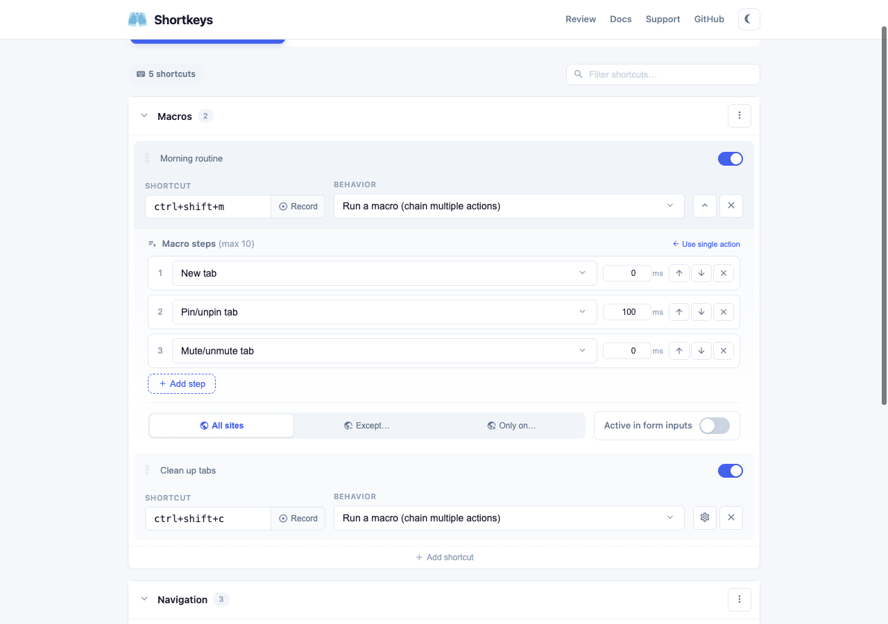

<p align="center">
  
</p>

<h1 align="center">Shortkeys</h1>

<p align="center">
  <strong>Custom keyboard shortcuts for your browser</strong><br>
  A cross-browser extension for Chrome, Firefox, Edge, and Opera with 200,000+ Chrome users.
</p>

<p align="center">
  <a href="https://chromewebstore.google.com/detail/shortkeys-custom-keyboard/logpjaacgmcbpdkdchjiaagddngobkck">Chrome Web Store</a> · <a href="https://addons.mozilla.org/firefox/addon/shortkeys/">Firefox Add-ons</a> · <a href="https://shortkeys.app">Website</a> · <a href="https://github.com/crittermike/shortkeys/issues">Issues</a>
</p>

<br>

<p align="center">
  
</p>

## Features

- ⚡ **125+ built-in actions** across 11 categories: scrolling, tabs, navigation, video controls, search, bookmarks, windows, zooming, page tools, page scripts, and more
- 🔍 **Command palette** - click the icon or set a shortcut to search and trigger any action
- 📦 **9 curated shortcut packs** - one-click install for Vim, Emacs, YouTube, Productivity, Developer, Reading, Tab Manager, Keyboard Power, and Media Control
- ☁️ **Cloud sync** with automatic local fallback when data exceeds sync quota
- 📁 **Groups** - organize shortcuts into collapsible, renamable sections with bulk enable/disable
- 🔗 **Macro chaining** - chain multiple actions into a single shortcut
- 🌐 **Site filtering** - all sites, blocklist, or allowlist per shortcut
- 🎬 **Live reload** - shortcuts update in all tabs instantly, no page refresh needed
- 🔗 **Shareable links** - generate a URL to share shortcuts or groups with anyone
- ⌨️ **Shortcut recorder** with multi-key sequence support (e.g. `g i`, `g h`)
- ⚠️ **Conflict detection** - platform-aware warnings for browser default clashes
- 🌙 **Dark mode** following system preference
- 📜 **Userscript import** from Greasyfork and OpenUserJS
- 🧙 **Guided onboarding** wizard for new users
- ↩️ **Undo/redo** in the settings page

<details>
<summary><strong>More screenshots</strong></summary>

### Custom JavaScript editor


### Macro chaining



### Dark mode


</details>

## Install

<table>
  <tr>
    <td align="center">
      <a href="https://chromewebstore.google.com/detail/shortkeys-custom-keyboard/logpjaacgmcbpdkdchjiaagddngobkck">
        <br>
        <strong>Chrome</strong>
      </a>
    </td>
    <td align="center">
      <a href="https://addons.mozilla.org/firefox/addon/shortkeys/">
        <br>
        <strong>Firefox</strong>
      </a>
    </td>
    <td align="center">
      <a href="https://microsoftedge.microsoft.com/addons/detail/shortkeys/">
        <br>
        <strong>Edge</strong>
      </a>
    </td>
    <td align="center">
      <a href="https://addons.opera.com/extensions/details/shortkeys/">
        <br>
        <strong>Opera</strong>
      </a>
    </td>
  </tr>
</table>

Or build from source:

```bash
npm install
npm run build          # Chrome → .output/chrome-mv3/
npm run build:firefox  # Firefox → .output/firefox-mv2/
```

## Development

```bash
npm run dev            # Chrome dev mode with hot reload
npm run dev:firefox    # Firefox dev mode
npm test               # Run all tests (569 tests across 21 files)
npm run test:watch     # Watch mode
npm run test:coverage  # With coverage report
```

## Project structure

```
src/
├── entrypoints/
│   ├── background.ts        # Service worker: messaging, action dispatch, storage sync
│   ├── content.ts           # Content script: Mousetrap key bindings, cheat sheet, dark mode
│   ├── options/             # Options page (Vue 3 SPA)
│   └── popup/               # Command palette popup
├── actions/                 # Action handlers and helpers
├── components/              # Vue components (CodeEditor, SearchSelect, ShortcutRecorder)
├── composables/             # Vue composables (useShortcuts)
├── packs/                   # 9 curated shortcut pack collections
└── utils/                   # Storage, URL matching, conflict detection, JS snippets

site/                        # shortkeys.app (Astro SSG, deployed to Netlify)
tests/                       # 569 tests across 21 files
```

## Tech stack

- **WXT** - Vite-based browser extension framework
- **Vue 3** - Composition API with `<script setup>`
- **TypeScript** throughout
- **Vitest** - 569 tests across 21 files
- **Mousetrap** - keyboard shortcut detection
- **CodeMirror 6** - JavaScript editor with syntax highlighting
- **Astro** - community website (shortkeys.app)

## Contributing

Pull requests are welcome. Please ensure all tests pass (`npm test`) before submitting. For bugs and feature requests, open a [GitHub issue](https://github.com/crittermike/shortkeys/issues).

## Support

Shortkeys is free and open source. If you find it useful, consider supporting development:

- ⭐ [Star this repo](https://github.com/crittermike/shortkeys)
- 💛 [Sponsor on GitHub](https://github.com/sponsors/crittermike)
- ☕ [Buy me a coffee](https://buymeacoffee.com/crittermike)
- 📝 [Leave a review](https://chromewebstore.google.com/detail/shortkeys-custom-keyboard/logpjaacgmcbpdkdchjiaagddngobkck/reviews)

## Credits and license

Icon by [Freepik](https://www.flaticon.com/authors/freepik) from [Flaticon](https://www.flaticon.com/).

Licensed under the [MIT License](LICENSE.md).
